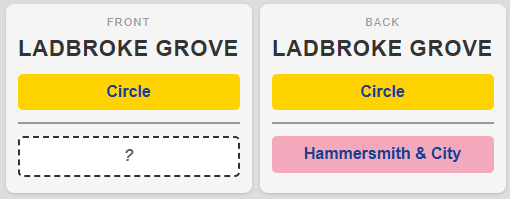
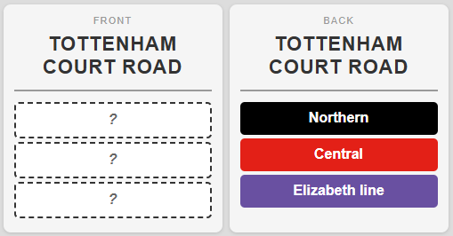
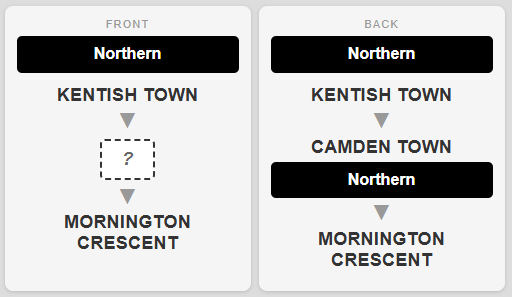

# London Transport Anki Flashcard Deck Generator

A Python script that generates a comprehensive Anki flashcard deck for learning the London transport network (Underground, Overground, DLR, Elizabeth line) using live data from the TfL API.

**Output:** `london_transport.apkg` — ~1,938 cards across 19 lines and ~420 stations.

## Quick Start

```bash
python3 -m venv venv
source venv/bin/activate
pip install -r requirements.txt
python generate_deck.py
```

First run fetches ~60 API responses (~2 minutes with rate limiting). Subsequent runs use cached data and complete in seconds. Import `london_transport.apkg` into Anki. To force fresh data, delete the `data/` directory.

## Data Attribution

Powered by [TfL Open Data](https://tfl.gov.uk/corporate/terms-and-conditions/transport-data-service).
Contains OS data &copy; Crown copyright and database rights 2016.
Geomni UK Map data &copy; and database rights [2019].

TfL data is licensed under the [Open Government Licence v2.0](https://www.nationalarchives.gov.uk/doc/open-government-licence/version/2/). This project is not endorsed by or affiliated with Transport for London.

## Card Types

### 1. Lines

**Goal:** Learn which lines serve each station.

Given a station name with some lines shown and some hidden, recall the missing line(s). National Rail is always shown as context (never hidden).

Progressive rounds hide increasing numbers of lines:

| Round | Hidden | Applies to |
|-------|--------|------------|
| 1 Missing | 1 line | All stations |
| 2 Missing | 2 lines | Stations on 3+ lines |
| ... | ... | ... |
| All Missing | All lines | Stations on 2+ lines |





All Lines cards go into a single shared deck with random ordering within each round. This prevents predicting the answer from the subdeck name — an early design lesson (see [Design Decisions](#design-decisions)).

### 2. Sequence

**Goal:** Learn the order of stations on each line.

Given a line and two neighboring stations, recall the station in between. Terminal stations show `═ TERMINUS ═`. On the back, the answer station is shown with the full list of lines serving it, teaching interchange knowledge as a bonus.



Each card randomly presents stations in either direction on each review (via JavaScript in the Anki template), so you learn the sequence both ways without doubling the card count.

### 3. Branch

**Goal:** Learn which branch each station is on.

Given a station name, recall which line(s) and branch(es) it's on. Only generated for stations on branch-specific sections (not shared trunk sections).

For example: Mornington Crescent → Northern (Charing Cross branch). Richmond → District (Richmond branch), Mildmay (Richmond branch).

**Note:** The Branch card generation currently has some issues — some cards are incorrect or unnecessary. For example, Aldgate East is incorrectly labeled as being on a branch when it's on the main District line, and Hammersmith & City line (which has no branches) generates unnecessary branch cards. These issues are known and may be addressed in future versions.

## Deck Structure

```
London Transport/
├── 1 Lines/
│   ├── 1 Missing        (587)
│   ├── 2 Missing        (171)
│   ├── 3 Missing        (102)
│   ├── 4 Missing         (45)
│   ├── 5 Missing         (12)
│   └── All Missing      (113)
├── 2 Sequence/
│   ├── Northern          (59)
│   ├── District          (66)
│   ├── DLR               (55)
│   └── ...per line      (632 total)
└── 3 Branch             (276)
```

## Visual Design

Cards are optimized for portrait mode on a phone. Line identity uses CSS-styled "flag boxes" replicating TfL's visual branding:

- **Underground/DLR/Elizabeth:** Solid colored rectangle with white or dark text, using official TfL hex colors
- **Overground:** White rectangle with a colored double-stripe at the top — each of the 6 named Overground lines (Liberty, Lioness, Mildmay, Suffragette, Weaver, Windrush) gets its own stripe color
- **National Rail:** Red flag box with double-arrow symbol (⇔)
- **Blank placeholder:** White box with dashed black border

All styling is pure HTML/CSS `<div>` elements — no SVG or images. This avoids the SVG attribute stripping in Anki 25.02.1+ and works across all Anki clients including mobile.

## How It Works

The script has five phases: fetch, build graph, merge stations, generate cards, and package.

### Phase 1: Fetch Data

Three TfL Unified API endpoints (free, no key required):

| Endpoint | Purpose |
|----------|---------|
| `/Line/Mode/tube,overground,dlr,elizabeth-line` | All 19 line IDs |
| `/Line/{lineId}/StopPoints` | Station metadata: name, modes, `hubNaptanCode` |
| `/Line/{lineId}/Route/Sequence/inbound` | Ordered station sequences per route segment |

Responses are cached to `data/*.json`. A 1.5-second delay between requests avoids TfL's rate limit (429 errors).

Both inbound and outbound sequences are fetched for station metadata, but only **inbound** segments are used for graph edges. Using both directions would create bidirectional edges that make every line appear circular and lose the directional information needed for sequence cards.

### Phase 2: Build Directed Graph

For each line, the inbound route segments are used to build a directed station graph. Each segment is a contiguous section of track returned by the API (e.g., "High Barnet → Finchley Central", "Finchley Central → Camden Town", "Camden Town → Mornington Crescent → Euston").

The graph stores predecessors and successors for each station on each line. This is used to detect branch points (stations with degree > 1) for Branch card generation.

Each segment also stores `branchId`, `nextBranchIds`, and `prevBranchIds` from the API response. These connectivity fields are used during Sequence card generation to enumerate all valid route connections at junction stations.

### Phase 3: Merge Cross-Mode Stations

**This is the trickiest part.** The TfL API assigns different NaPTAN IDs to different modes at the same physical station:

| Station | Tube ID | DLR ID | Overground/Elizabeth ID |
|---------|---------|--------|------------------------|
| Bank | `940GZZLUBNK` | `940GZZDLBNK` | — |
| Highbury & Islington | `940GZZLUHAI` | — | `910GHGHI` |
| Stratford | `940GZZLUSTD` | `940GZZDLSTD` | `910GSTFD` |

Without merging, Bank would only show tube lines and miss DLR. Highbury & Islington would miss its Overground lines.

The fix uses `hubNaptanCode` — a field on each stop point that identifies the physical station complex. All NaPTAN IDs sharing a hub code are merged into one station entry:

1. Group all NaPTAN IDs by their `hubNaptanCode`
2. For hubs with multiple IDs, pick a canonical ID (prefer tube > DLR > rail)
3. Merge line sets, National Rail flags, and pick the shortest/cleanest name
4. Remap all graph edges and segment stop lists to use canonical IDs

**National Rail supplement:** The per-line StopPoints endpoint only reports modes for that line — tube stations don't include `national-rail` even at major NR interchanges like King's Cross. The script supplements with NR flags from Overground/Elizabeth data (which do include NR modes) plus a curated list of ~57 exact station names (`NR_INTERCHANGE_EXACT_NAMES`).

### Phase 4: Generate Cards

**Lines cards:** For each station, generate C(N, k) cards for each round k, hiding every combination of k lines. Cards are randomly shuffled within each round (deterministic seed for reproducible builds).

**Sequence cards:** Generated in two passes:

*Pass 1 — Segment walk:* For each segment, iterate over station positions. Interior stations get prev/next from the segment directly. Boundary stations are stitched to connecting segments via label-aware endpoint matching — when multiple segments meet at a junction, the stitcher prefers segments with the same branch label to avoid cross-branch errors (e.g., connecting a Bank branch segment to a Charing Cross branch segment at Euston). Fallback to graph adjacency if no connecting segment found. TERMINUS only at true line terminals.

*Pass 2 — Junction fill:* At junction stations where multiple branches meet (e.g., Camden Town on the Northern line), the first pass only generates cards for the segment pairs it happened to stitch together. The second pass uses the API's `nextBranchIds`/`prevBranchIds` fields to enumerate all valid route connections and generates cards for any missing (prev, station, next) triples. This ensures full coverage — e.g., both "Chalk Farm → Camden Town → Euston" and "Kentish Town → Camden Town → Euston" are generated.

Each card stores both forward and reverse HTML. The Anki template uses JavaScript to randomly pick a direction on each review, so you learn the sequence in both directions without doubling the card count.

**Branch cards:** For each segment with a non-None branch label, all stations on that segment are collected. Each station gets one card showing all the (line, branch) pairs it belongs to.

### Phase 5: Package

The `genanki` library creates Anki note models with embedded CSS and front/back HTML templates. Cards are organized into subdecks using Anki's `::` separator convention and packaged into a single `.apkg` file.

## Design Decisions

These decisions emerged from iterative testing:

**Lines cards in a shared deck, not per-line subdecks.** The original design put "hide Northern" cards in the Northern subdeck. But then every card in that subdeck always had the same answer — you'd know it was Northern before even reading the card. Moving all Lines cards into one shared, shuffled deck eliminated this problem.

**Sequence cards from segments + API branch connectivity.** Segment-based generation avoids the naive graph cross-product (which would create invalid paths at junctions). A second pass uses the API's `nextBranchIds`/`prevBranchIds` to enumerate all valid route connections at junction stations, ensuring full coverage without generating cards for paths no train takes.

**No branch labels on Sequence cards.** The neighboring stations already tell you which branch you're on — if the card shows Warren Street and Tottenham Court Road, it's obviously the Charing Cross branch. Branch knowledge is tested separately by Branch cards.

**Bidirectional Sequence cards via JS randomization.** Rather than generating separate forward and reverse cards (which would double the count for the same answer), each card stores both directions and a JavaScript snippet randomly picks one on each review.

**Inbound segments only for the graph.** Using both inbound and outbound creates bidirectional edges (A→B and B→A for every pair), making every line look circular and every station look like a branch point. One direction gives clean, directed paths.

**Station merging via hub codes.** Name-based matching is fragile (different suffixes, abbreviations, spelling variants). The `hubNaptanCode` field is a first-party identifier that TfL uses internally to group platforms at the same physical station.

## Adapting for Another Transit System

The architecture is transit-system-agnostic. The London-specific parts are isolated in constants and data-fetching functions. Here's what to change:

### 1. Data Source

Replace the `fetch_*` functions with your system's data. You need three things per line:

- **Line list** with IDs, display names, and colors
- **Station metadata** per line: station ID, name, modes/transfers, and a parent station ID for merging
- **Ordered station sequences** per line: the order trains visit stations, broken into segments at branch points

**For GTFS-based systems** (NYC MTA, most US/European transit):

| GTFS file | Maps to |
|-----------|---------|
| `routes.txt` | Line list with colors (`route_color`) |
| `stops.txt` | Station names, IDs, and `parent_station` for merging |
| `stop_times.txt` + `trips.txt` | Station order per line per direction |

Parse one `direction_id` from `trips.txt` for consistent direction. Group consecutive stops into segments that break at branch points (where the set of trips diverges).

**For REST APIs** (like TfL): the fetch/cache pattern in the script works directly. Adapt the URL patterns and response field names.

### 2. LINE_INFO

Replace the entire dict with your system's lines:

```python
LINE_INFO = {
    "1": {"name": "1", "hex": "#EE352E", "text": "white", "mode": "subway"},
    "A": {"name": "A", "hex": "#0039A6", "text": "white", "mode": "subway"},
    "SIR": {"name": "SIR", "hex": "#0039A6", "text": "white", "mode": "sir"},
    # ...
}
```

The `mode` field drives visual styling. For London, `"overground"` triggers the white-background double-stripe style. Define your own mode categories for different visual treatments.

### 3. LINE_ORDER

The curriculum order for Sequence subdecks. Put the line you want to learn first at position 0. Consider ordering by: most useful lines first, or lines with the most interchanges first (so you encounter shared stations early and reinforce them).

### 4. BRANCH_RULES

Map station name substrings to canonical branch names. Each rule is a `(set_of_substrings, label)` pair. For a segment, the first rule where any station name contains any substring wins. Order rules from most specific to most general.

```python
BRANCH_RULES = {
    "A": [
        ({"Lefferts", "Ozone Park"}, "Lefferts Blvd branch"),
        ({"Far Rockaway"}, "Far Rockaway branch"),
        ({"Rockaway Park", "Beach"}, "Rockaway branch"),
    ],
    "7": [
        ({"Flushing", "Main St"}, "Flushing branch"),
    ],
}
```

Lines with no branches don't need entries — they'll get no branch labels by default.

### 5. Station Name Cleaning

Update `SUFFIXES_TO_STRIP` for your system's naming conventions:

```python
# NYC example
SUFFIXES_TO_STRIP = [" Station", " - "]
```

Be careful not to strip meaningful parts of names (e.g., "Battersea Power Station" should keep "Station").

### 6. Station Merging

Replace `hubNaptanCode` with your system's equivalent:

- **GTFS:** Use `parent_station` from `stops.txt`. This is the direct equivalent — stations sharing a parent are at the same physical location.
- **No parent field:** Fall back to name-based matching (clean both names and match). This is fragile but workable.

The `_merge_hub_stations()` function structure stays the same — just change where the merge key comes from.

### 7. Interchange/Transfer Supplement

Like `NR_INTERCHANGE_EXACT_NAMES` for London's National Rail, you'll likely need a curated set for connections that the primary data doesn't capture:

- **NYC:** Connections to PATH, LIRR, Metro-North, NJ Transit, ferry
- **Paris:** Connections to RER, Transilien, TGV stations
- **Tokyo:** Connections to JR, private railways

### 8. Visual Style

Update the CSS `.line-*` classes with your system's official colors. Consider different visual treatments:

```css
/* NYC: circular bullets instead of rectangular flag boxes */
.line-flag {
    display: inline-block;
    width: 36px; height: 36px;
    border-radius: 50%;
    line-height: 36px;
    text-align: center;
    font-weight: bold;
    font-size: 1.1rem;
}
```

### What Stays the Same

These components work for any transit system without modification:

- `genanki` packaging and note model definitions
- Combinatorial Lines card generation (all the C(N,k) round logic)
- Segment-based Sequence card generation with boundary stitching and junction fill
- Branch card generation from segment labels
- HTML front/back template structure
- Deduplication by (line, prev, target, next) tuples
- Station merging framework (just change the merge key)
- Random shuffling within card groups
- API response caching

### Adaptation Checklist

| Component | What to change |
|-----------|---------------|
| `fetch_*` functions | Your API endpoints or GTFS parsing |
| `LINE_INFO` | Your lines, colors, modes |
| `LINE_ORDER` | Your preferred learning order |
| `BRANCH_RULES` | Your branch names and identifying stations |
| `SUFFIXES_TO_STRIP` | Your station name suffixes |
| `NR_INTERCHANGE_EXACT_NAMES` | Your commuter rail / other mode connections |
| `hub_map` source | Your parent station field |
| CSS `.line-*` classes | Your line colors and visual style |

## File Structure

```
tfl/
├── generate_deck.py          # Main script — generates london_transport.apkg
├── generate_preview.py       # Generates preview.html for browser viewing
├── data/                     # Cached API responses (auto-created)
│   ├── all_lines.json
│   ├── stops_{line}.json     # 19 files, one per line
│   ├── route_{line}_{dir}.json  # 38 files, inbound + outbound per line
│   └── ...
├── london_transport.apkg     # Output deck
├── preview.html              # Full HTML preview of all cards
├── venv/                     # Python virtual environment
└── README.md
```

## Previewing Without Anki

To preview all cards in a browser, run `generate_preview.py`. It generates a collapsible HTML page with every card's front and back, organized by subdeck.

```bash
source venv/bin/activate
python3 generate_preview.py
```

## Verification

The deck was audited by cross-checking against known London transport data:

- **14 major interchange stations** verified for correct line assignments (Bank, King's Cross, Stratford, Paddington, Liverpool Street, Oxford Circus, Green Park, Highbury & Islington, Baker Street, Canning Town, West Ham, Whitechapel, Earl's Court, Waterloo)
- **Victoria line** complete 16-station sequence verified
- **Northern line** all branch sequences verified (High Barnet, Edgware, Mill Hill East, Charing Cross, Bank, Morden, Battersea Power Station)
- **Branch assignments** verified for 8+ key stations (Mornington Crescent = Charing Cross, King's Cross = Bank, etc.)
- **National Rail flags** verified for 13 NR stations and 6 non-NR stations
- **Station presence** confirmed for recent additions (Battersea Power Station, Nine Elms, Bond Street Elizabeth line)
